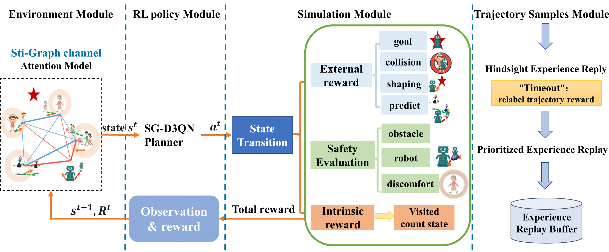
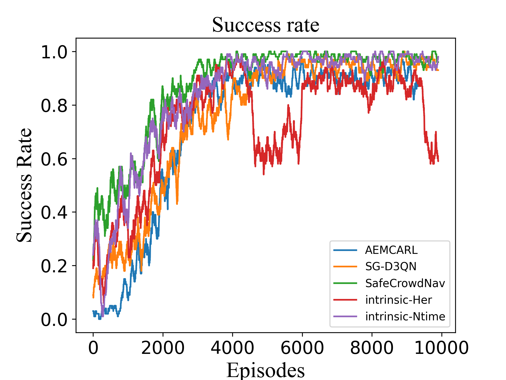
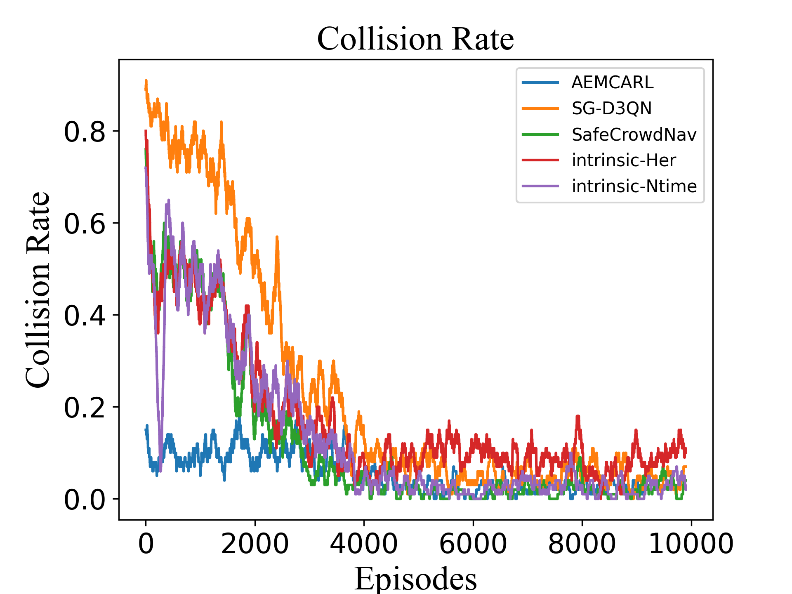
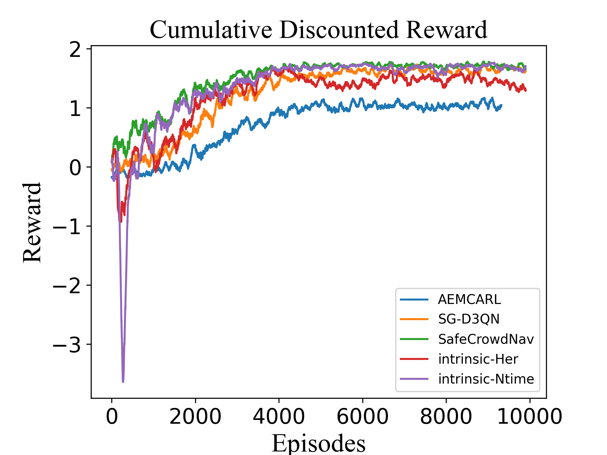
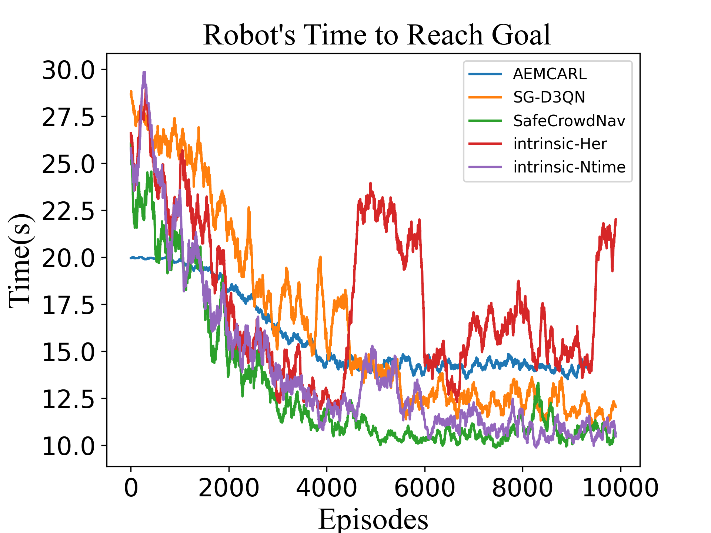
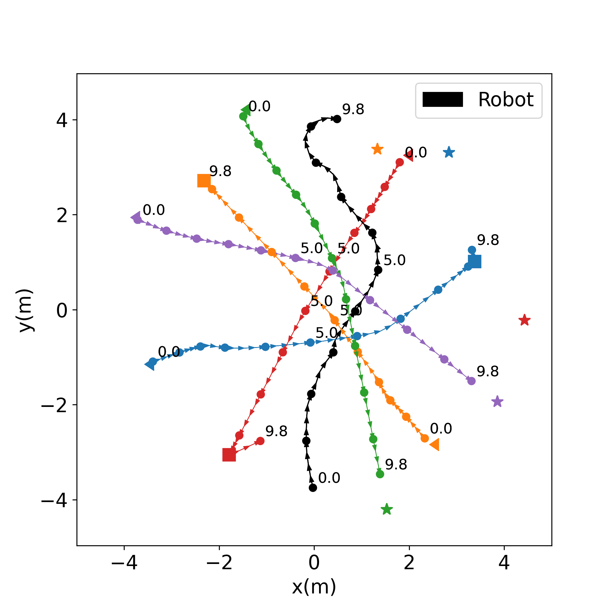
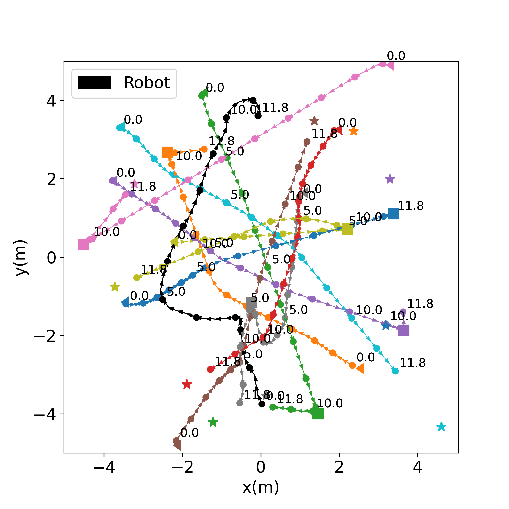
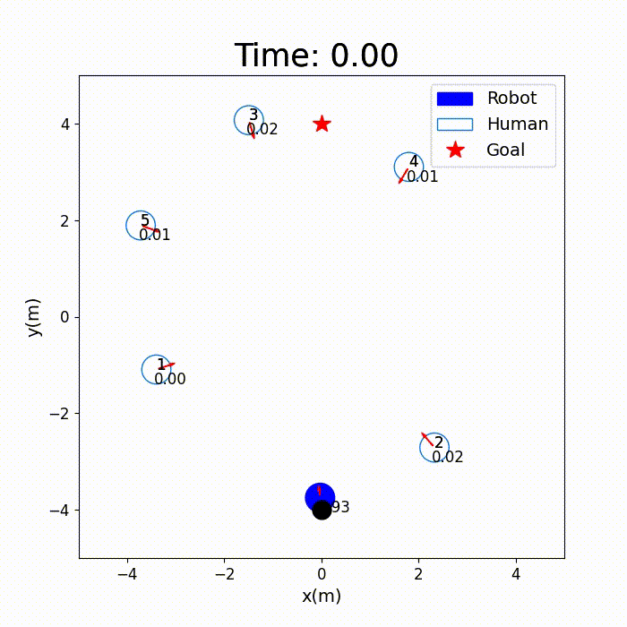
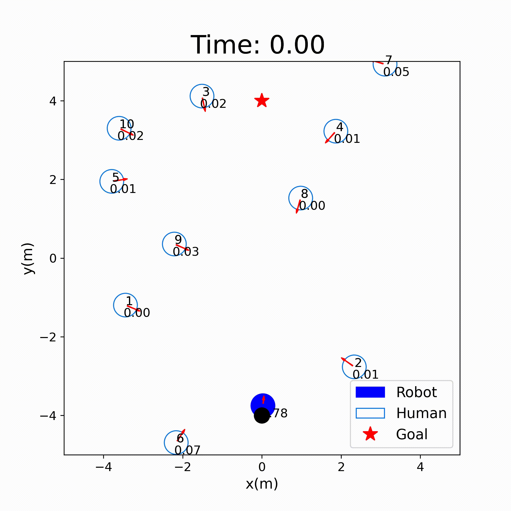

# SafeCrowdNav: Safety Evaluation of Robot Crowd Navigation in complex scenes

# Paper
This paper is available in frontiers.[SafeCrowdNav](https://www.frontiersin.org/articles/10.3389/fnbot.2023.1276519/full)

## Abstract
Navigating safely and efficiently in dense crowds remains a challenging problem for mobile robots. The interaction mechanisms involved in collision avoidance require robots to exhibit active and foresighted behaviors while understanding the crowd dynamics. Deep reinforcement learning methods have shown superior performance compared to model-based approaches. However, existing methods lack an intuitive and quantitative safety evaluation for agents, and they may potentially trap agents in local optima during training, hindering their ability to learn optimal strategies. In addition, sparse reward problems further compound these limitations. To address these challenges, we propose SafeCrowdNav, a comprehensive crowd navigation algorithm that emphasizes obstacle avoidance in complex environments. Our approach incorporates a safety evaluation function to quantitatively assess the current safety score and an intrinsic exploration reward to balance exploration and exploitation based on scene constraints. By combining prioritized experience replay and hindsight experience replay techniques, our model effectively learns the optimal navigation policy in crowded environments. Experimental results demonstrate that our approach enhances the robot's understanding of the crowd, leading to lower collision probabilities and shorter navigation times compared to state-of-the-art algorithms.

## Method Overview


## Setup
1. Install [Python-RVO2](https://github.com/sybrenstuvel/Python-RVO2) library
2. Install [socialforce](https://github.com/ChanganVR/socialforce) library
2. Install crowd_sim and crowd_nav into pip
```
pip install -e .
```

## Getting Started
This repository are organized in two parts: crowd_sim/ folder contains the simulation environment and crowd_nav/ folder contains codes for training and testing the policies. Details of the simulation framework can be found [here](crowd_sim/README.md). Below are the instructions for training and testing policies, and they should be executed
inside the crowd_nav/ folder.

```
parser.add_argument('--policy', type=str, default='tree-search-rl')
parser.add_argument('--config', type=str, default='configs/icra_benchmark/ts_separate_curiosity.py')
parser.add_argument('--output_dir', type=str, default='data/output')
parser.add_argument('--gpu', default=True, action='store_true')
```

1. Train a policy.
```
python train.py 
```
2. Test policies with 1000 test cases.
```
python test.py
```
3. Run policy for one episode and visualize the result.
```
python test.py
```

```
python test.py --traj
```
```
python test.py --traj --human_num 10
```

4. plot the result

 in crowdnav/plotall folder
```
(xjcrowdnav) xxx@xxx-amd:/mnt/f/xujing/intrinsic-Her-Ntime/crowd_nav/plotall$ python plot.py data/ --plot_time
```

## metrics
|               Success Rate               |              Collision Rate              |
| :----------------------------------------: | :----------------------------------------: |
|  |  |
|               Reward               |              time               |
|  |  |

## Trajectory Diagram
|              Simple Scenario               |              Complex Scenario              |
| :----------------------------------------: | :----------------------------------------: |
|  |  |
## Safety Weights

|                Simple Scenario                |               Complex Scenario                |
| :-------------------------------------------: | :-------------------------------------------: |
|  |  |

## Video Demo

|     Holonomic Robot in Simple Scenarios      |      Holonomic Robot in Complex Scenarios  |
| :--------------------------------------------: | :--------------------------------------------: | 
|  |  | 


## Acknowledge
This work is based on [CrowdNav](https://github.com/vita-epfl/CrowdNav) and [SG-D3QN](https://github.com/nubot-nudt/SG-D3QN) and [intrinsic-SGD3QN](https://github.com/dmartinezbaselga/intrinsic-rewards-navigation.git).  The authors are thankful for their works and for making them available.

## Citation
@article{xu2023safecrowdnav,
  title={SafeCrowdNav: safety evaluation of robot crowd navigation in complex scenes},
  author={Xu, Jing and Zhang, Wanruo and Cai, Jialun and Liu, Hong},
  journal={Frontiers in neurorobotics},
  volume={17},
  year={2023},
  publisher={Frontiers Media SA}
}

